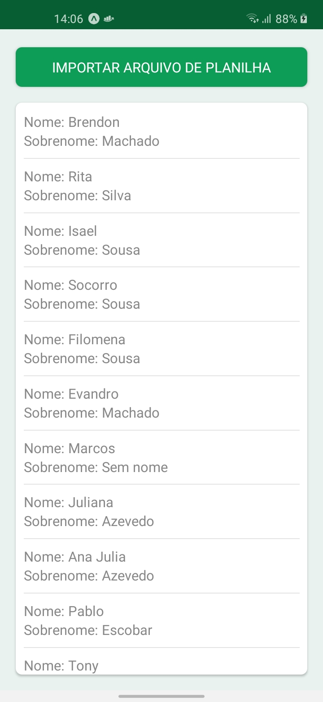

<h1 align="center">
  
  
</h1>
<br>
<h4 align="center">
  <p>
    <a href="https://www.linkedin.com/in/brendon-machado">
      
    </a>
    
  </p>
</h4>
<br>

### Objetivo

Aplicação destinada a mostrar como utilizar a biblioteca XLSX em React Native com Expo.

### Como usar?

Você vai precisar ter instalado em sua maquina:

- [Node JS](https://nodejs.org/)
- [Expo](https://expo.io/)

```bash
# Dê um git Clone

$ git clone https://github.com/benmacario/sheets-xlsx-RN.git

# Em seguida entre na pasta do projeto

$ cd sheets-xlsx-RN

# Instale as dependencias

$ yarn

#Você pode rodar o projeto com

$ yarn android

#ou

$ yarn ios

# Ou apenas

$ expo start

# Talvez precise instalar o App da Expo Go em seu emulador/device
```

### Referencias

- [Document-Picker-Expo](https://docs.expo.io/versions/latest/sdk/document-picker/)
- [File-System-Expo](https://docs.expo.io/versions/latest/sdk/filesystem/)
- [XLSX](https://www.npmjs.com/package/xlsx)

### Licença

Esse projeto está sob a licença MIT. Veja o arquivo [LICENSE](LICENSE) para mais detalhes.

---

Feito com ❤️ by [Brendon Machado](https://www.linkedin.com/in/brendon-machado)!
